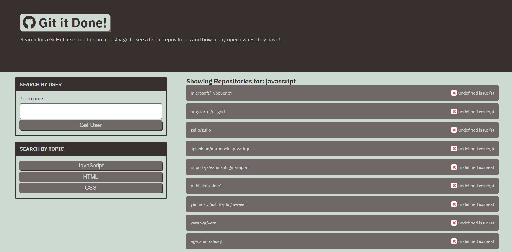

# git-it-done

## Purpose
A website allows the user to search for open issues either for an individual user on github, or to search by three popular languages.

## Built with
* HTML
* CSS
* Javascript

## Demonstrates the following skills:

    * Working with an array of Objects.
    * Working with arrays.
    * Working with strings.
    * Working with complicated logic
    * Dynamically creating web elements.
    * Dynamically updated API calls depending on what the user wanted.
    * Changed query strings while accessing github's API
    * Ability to read server-side API.
    * Used an HTTP request response to display data to a user.
    * Handled fetch responses and accounted for errors.

## Website
https://tgtiburon.github.io/git-it-done/

##

Made by Tony Gendreau as part of a class tutorial

